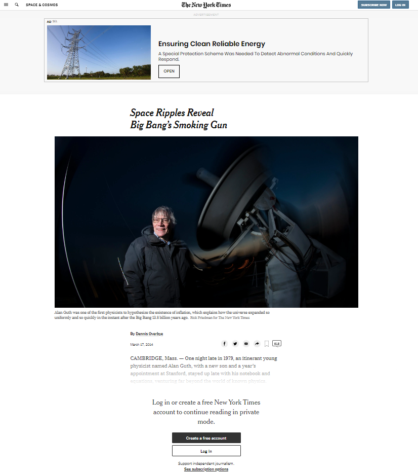

# NYT_clone_page

> This is New York Times page clone, here we are cloning the "Space Ripples Reveal Big Bang’s Smoking Gun" article.

## The project features includes:

- Embedding images 
- Working with forms 
- Floats and positioning 
- The box model 

## Built With

- HTML5 and CSS3  
- Stickler-ci (Linter) and W3C validator  
- VScode, Git and Github  

## Live Demo

- None yet

## Getting Started

To get a local copy up and running follow these simple example steps.

### Prerequisites
Download Git at https://git-scm.com/downloads 
Make a Github account with SSH key setup in your current machine.

### Setup
Clone the repository with terminal: 
git@github.com:SevlaMare/mint-sign-up-clone.git

Ready to use

## Authors

👤 **Johann Rodriguez**

- Github: [@githubhandle](https://github.com/JohannRodriguez)
- Twitter: [@twitterhandle](https://twitter.com/JohannRodriguez)
- Linkedin: [linkedin](https://linkedin.com/JohannRodriguez)

👤 **Sebastian Gil Rodriguez**

- Github: [@githubhandle](https://github.com/IBuggie)
- Twitter: [@twitterhandle](https://twitter.com/IBuggie)
- Linkedin: [linkedin](https://www.linkedin.com/in/IBuggie)

## 🤝 Contributing

Contributions, issues and feature requests are welcome!

Feel free to check the [issues page](issues/).

## Show your support

Give a ⭐️ if you like this project!

## 📝 License

This project is [MIT](lic.url) licensed.